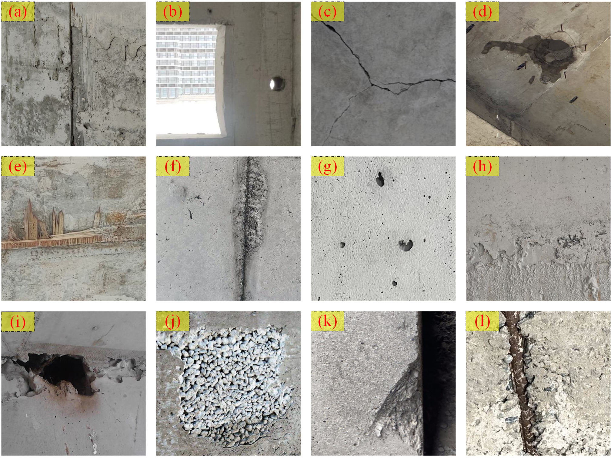

# CDR-dataset

This is a public dataset for concrete defect recognition. 
We redefined 12 common concrete surface defects. Here is an example of defects from the dataset.

(a) formwork misalignment, (b) formwork deformation, (c) crack, (d) seepage, (e) inclusions, (f) mortar leakage, (g) airhole, (h) pitting surface, (i) voids, (j) honeycombing, (k) missing edge, (l) exposed reinforcement.

## 📁 Dataset Structure

The dataset includes:

- `Concrete defect recognition/`: Original image files
-- Airhole/
--Crack/
--Exposed reinforcement/
  ……

## 📥 Download

You can download the entire dataset from the following Google Drive link:

🔗 **[Download MyDataset.zip](https://drive.google.com/uc?id=FILE_ID&export=download)**

*(Make sure the link is accessible to anyone)*

> If the above link does not work, try the shared view link:  
> [https://drive.google.com/file/d/FILE_ID/view?usp=sharing](https://drive.google.com/file/d/FILE_ID/view?usp=sharing)

## 📄 License

This dataset is licensed under [your license, e.g., MIT, CC BY 4.0, etc.]. Please cite this repository if you use the data.

## 📬 Contact

For questions or collaboration: [your email or GitHub]
